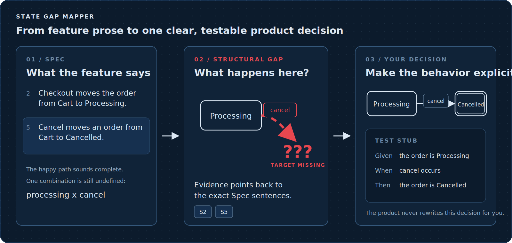
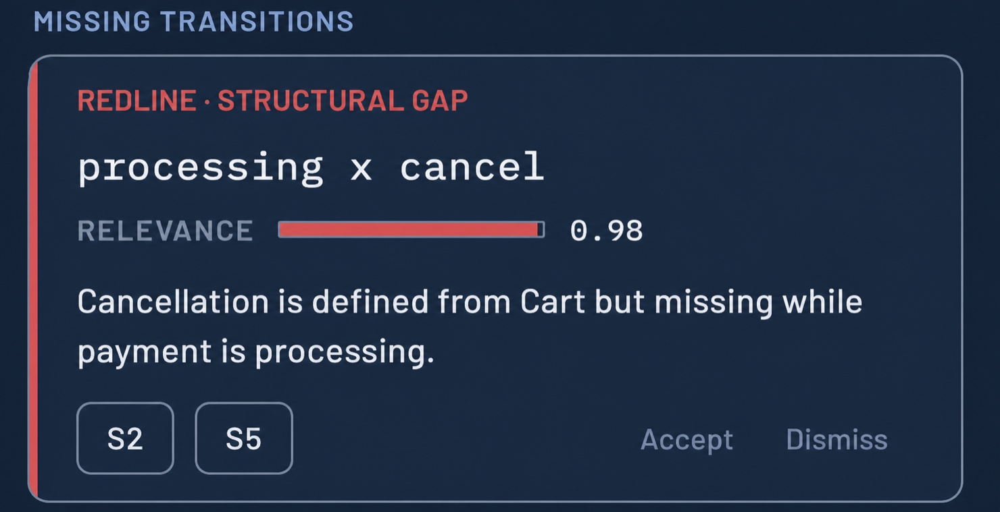
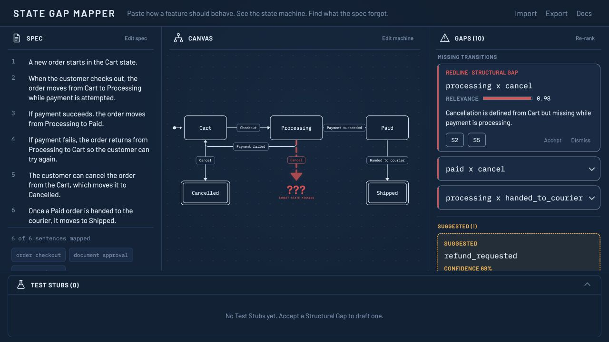
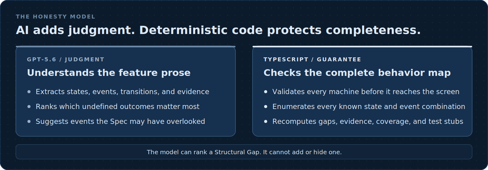

# State Gap Mapper

**Find the behavior your feature spec forgot before it becomes a bug.**

Paste a product flow in plain English. State Gap Mapper shows how it behaves, redlines places where the outcome is undefined, connects every finding to the original words, and turns approved decisions into test-ready steps.

[Watch the 2:45 demo](https://youtu.be/-kOouhl8B78) · [Try the live app](https://state-gap-mapper-build.vercel.app) · [Explore the reproducible demo source](./demo-video/README.md)



## The short version

Feature specs are usually good at describing the happy path. The costly questions appear when a known event happens at an unexpected moment:

- What happens if a customer cancels while payment is processing?
- What happens if an approval is withdrawn after publication begins?
- What happens when a verification code expires?

State Gap Mapper turns the Spec into a visual behavior map, checks every applicable combination of a non-final state and a known event, and marks the undefined outcomes. A reviewer then decides whether each one is a real omission or an intentional non-transition.

The diagram is the explanation surface. Finding missing behavior is the product.

## A real example

The checkout sample says:

1. Checkout moves an order from **Cart** to **Processing**.
2. Payment success moves it to **Paid**.
3. Payment failure returns it to **Cart**.
4. Cancellation works from **Cart**.

The Spec never says what cancellation should do while the order is **Processing**.

State Gap Mapper therefore shows `processing x cancel` as a red Structural Gap. It attaches sentences 2 and 5 as Evidence, so the reviewer can see exactly why the question exists.



If the reviewer chooses **Cancelled** as the intended target, the red `???` becomes a normal transition and the application drafts:

```gherkin
Given the system is in state Processing
When cancel occurs
Then the system moves to Cancelled
```

The product decision remains human. State Gap Mapper makes the missing decision visible and turns the answer into usable engineering output.

## What you do in the app

1. **Paste or import a Spec.** Type plain-English behavior, load a `.txt`, `.md`, or `.markdown` file, or choose one of the three instant samples.
2. **Map the behavior.** GPT-5.6 extracts the states, events, transitions, and sentence Evidence into an editable diagram.
3. **Review the redlines.** Deterministic TypeScript evaluates the full state-and-event matrix, marks final-state cells as not applicable, and lists every missing transition from a non-final state.
4. **Make the product decision.** Accept a gap and choose its target, or Dismiss it when the undefined behavior is intentional.
5. **Use the output.** Copy the generated Test Stub, download a Markdown report, or save a lossless JSON project that can be reopened later.



The cached samples load without an API call, so anyone can try the complete interface immediately.

## What the visual language means

| What you see | What it means |
| --- | --- |
| Chalk-colored nodes and lines | Behavior the Spec actually defines, or behavior you explicitly added |
| Red arrow ending in `???` | A known event has no defined outcome in that state |
| Red Structural Gap card | A deterministic finding that needs a human decision |
| Amber Suggested Event card | An AI suggestion for an event the Spec may not have considered |
| Sentence chips such as `S2` and `S5` | Evidence linking the finding back to the original Spec |
| `added by you` | A state, event, or transition created by the reviewer rather than extracted from the Spec |

Red and amber deliberately mean different things. A Structural Gap is a computed fact about the current map. A Suggested Event is a possibility proposed by GPT-5.6.

## Why the result stays honest



GPT-5.6 handles semantic work: understanding the prose, extracting the machine, ranking the most relevant undefined outcomes, explaining them, and suggesting plausible new events.

Deterministic TypeScript remains authoritative for validation, the complete Structural Gap set, Evidence composition, coverage changes, and Test Stub generation. Ranking changes the order, the rationales, and the suggested targets. It cannot invent a Structural Gap in the current map, remove one, or hide one.

Extraction quality still matters, because the model decides the initial states, events, transitions, and final-state flags, and the gap set is computed from that map. That is why the canvas is editable and why sentence coverage is shown: both make the model's reading of the Spec reviewable, and every edit recomputes the gaps deterministically.

Accepting a gap is always a reviewer decision. The application never silently rewrites the product behavior.

## How this was built with Codex and GPT-5.6

The repository was created from scratch inside the July 18 to July 21, 2026 submission window, with
no pre-existing code.

**Where Codex accelerated the work.** Codex was the implementation partner across the domain model,
the strict runtime decoders that validate every model response before it reaches the screen, the
deterministic gap engine, the editable React Flow canvas, the import and export pipeline, production
debugging, deployment verification, and the reproducible Remotion demo. It wrote the bulk of the 232
tests across 23 files that guard this behavior.

**Where the human made the call.** The central decision was refusing to let the model find the gaps.
The obvious build is to ask GPT-5.6 what is missing from a Spec. That version was rejected before it
was written, because one invented finding in front of a technical reviewer destroys trust in every
real one. Existence is deterministic and prioritization is the model's job, so the tool can be wrong
about ordering and never about the facts of a given map. That decision is recorded in
[ADR 0002](./docs/adr/0002-two-tier-gaps-llm-ranks-never-detects.md), and it is why the interface
separates red from amber. Product positioning, the refusal behavior on non-viable input, and the
redline visual language were also human calls.

**What GPT-5.6 does at runtime.** Structured-output extraction of states, events, transitions, and
sentence Evidence; Relevance ranking with a rationale per gap; target suggestions on Accept; and
Suggested Events the Spec never mentioned.

**Tooling disclosure.** Codex was the primary implementation partner across multiple interactive
sessions; the Session ID submitted with this project is the most representative core-build thread.
Claude Code supported initial planning and design, the import and export specification, licensing and
repository cleanup, and submission assets. Human direction set the product position, architecture,
and design decisions.

## Who it helps

- **Product managers** can expose ambiguous behavior before a handoff becomes rework.
- **Engineers** can turn prose into a reviewable state model and concrete edge-case questions.
- **QA teams** can trace missing behavior to the Spec and convert decisions into Given/When/Then starting points.
- **Cross-functional teams** can review the same visual model instead of interpreting the same paragraph differently.

State Gap Mapper works best with structured behavioral flows: named situations, events, and resulting outcomes. It will refuse input that is not a viable feature Spec. It is not intended for strategy documents, free-form brainstorming, or general-purpose diagram generation.

## Files, saving, and privacy

| Action | What happens |
| --- | --- |
| Import `.txt`, `.md`, or `.markdown` | The local file fills the Spec editor. It is not mapped until you choose **Map this spec**. |
| Map a novel Spec | The Spec is sent through the application's serverless endpoint to OpenAI for structured extraction and ranking. |
| Open a State Gap Mapper `.json` project | The validated project is restored locally without an LLM call. Structural Gaps are recomputed rather than trusted from the file. |
| Download a Markdown report | A deterministic human-readable report is created in the browser. |
| Download a JSON project | A lossless logical project file is created in the browser so the work can be reopened later. |

State Gap Mapper has no account system and no project database. Work lives in the current browser session unless you download a project file.

## Frequently asked questions

### Is every red gap an AI guess?

No. Red Structural Gaps come from deterministic analysis over the extracted behavior map. GPT-5.6 only ranks them by likely relevance and provides a rationale.

### What is a state?

A state is a named situation the feature can be in, such as **Cart**, **Processing**, **Paid**, or **Cancelled**.

### What is a Suggested Event?

It is an event GPT-5.6 believes the feature may need, even though the Spec never mentions it. Suggested Events are amber, carry a Confidence score, and remain visually separate from factual Structural Gaps.

### Does accepting a gap change the original Spec?

No. It changes the editable behavior map and creates a Test Stub. The original Spec remains visible as Evidence.

### Can I try it without an API key?

Yes. The three cached sample projects work immediately. An API key is needed only when running the project locally and mapping a novel Spec.

### Can I save my work?

Yes. Download a JSON project and reopen it later. You can also download a Markdown report for documentation or review.

### Can I reuse the source code?

Yes. The project is released under the MIT license, so you are free to use, modify, and redistribute it.

## Run it locally

Requires Node.js 20.19 or later. The three bundled samples and the complete review workflow need no account and no API key:

```bash
npm ci
npm run dev
```

Open the local URL printed by Vite and choose a sample.

To map a novel Spec locally, run the serverless API route with an OpenAI API key:

```bash
cp .env.example .env.local   # add your OPENAI_API_KEY
npx vercel dev --local
```

The `--local` flag starts the dev server without linking a Vercel account. For judging, the hosted app above is the fastest path and needs no setup at all.

## Technical reference

TypeScript · React · Vite · React Flow · Zustand · OpenAI GPT-5.6 structured outputs · Vercel

| Path | What it contains |
| --- | --- |
| [`CONTEXT.md`](./CONTEXT.md) | Product vocabulary and invariants |
| [`DESIGN.md`](./DESIGN.md) | Binding visual system and component anatomy |
| [`docs/adr/`](./docs/adr/) | Architecture decisions for the state model, gap engine, and Evidence |
| [`demo-video/`](./demo-video/) | Reproducible 2:45 Remotion demo and verified production captures |
| [`samples/`](./samples/) | The three built-in behavioral Specs and cached results |
| [`tests/`](./tests/) | Domain, API, store, component, and file-transfer coverage |

The application is live and production-verified at [state-gap-mapper-build.vercel.app](https://state-gap-mapper-build.vercel.app).

## License

Released under the MIT license. See [`LICENSE`](./LICENSE).
