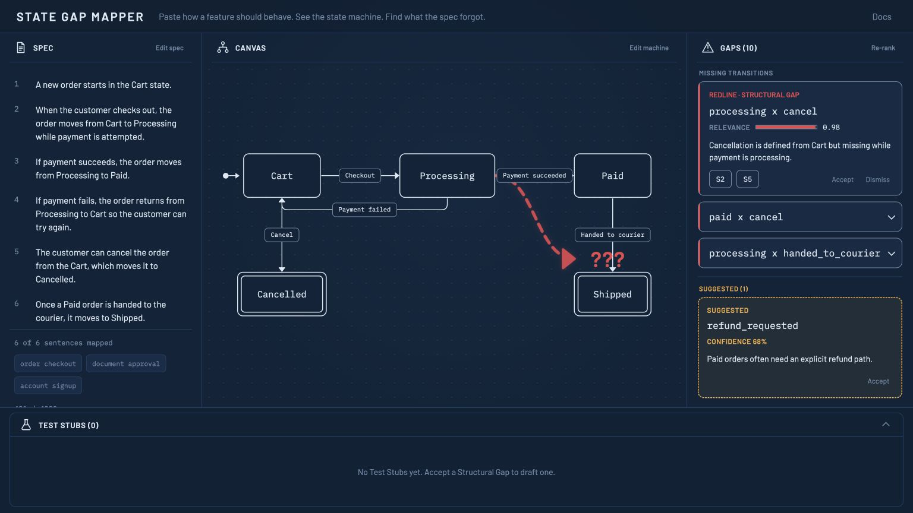
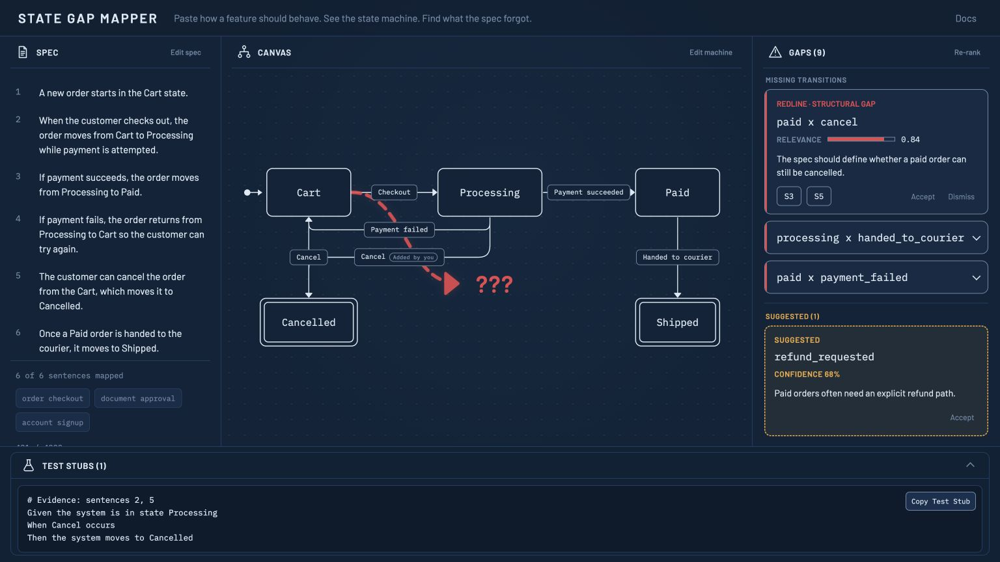

# State Gap Mapper

**A spec linter that reads a plain-English feature spec, draws the state machine it describes, and marks what the spec forgot.**

Paste how a feature should behave. See the state machine. Find what the spec forgot.

Track: Developer Tools. Built with Codex, powered by GPT-5.6.

[Try the live app](https://state-gap-mapper-build.vercel.app) · [Reproduce the canonical demo video](./demo-video/README.md)

## What it does

1. **Paste** a feature's behavior in plain English (or load a sample).
2. GPT-5.6 extracts a schema-constrained **state machine**, rendered as an interactive, editable graph (React Flow).
3. Deterministic analysis flags every **Missing Transition** and unhandled event as a gap, with a relevance score and evidence links back to the exact spec sentences.
4. The top gap renders on the canvas as a **redline ghost annotation**: a red dashed arrow into a `???`, as if a reviewer sketched the missing case in pencil.
5. **Accept** a gap to draw the transition in and generate a Gherkin **test stub**; **dismiss** it to mark it intentional.

The two-tier honesty model matters: deterministic graph math *detects* gaps (never hallucinated), the LLM only *ranks* them. See `docs/adr/`.

## See it in action

The flagship sample exposes a missing cancellation path while payment is processing. Selecting the gap connects the redline on the canvas to the supporting spec evidence.



Accepting the gap turns the redline into a real edge and creates a ready-to-copy test stub.



The canonical 2:45 video uses eight authentic production captures and focal camera moves to show the flagship gap, evidence, acceptance, test stub, Sample 3 cascade, and live gap recomputation. The Figma audit board remains an internal UX decision artifact rather than a submission screenshot.

## Built with Codex and GPT-5.6

Codex did the implementation heavy lifting across strict runtime decoders, the state-machine taxonomy, the deterministic gap engine, the editable canvas, test coverage, production hardening, and the Remotion demo. Human decisions set the product position, ADRs, two-tier honesty model, and redline design language.

GPT-5.6 powers schema-constrained extraction and relevance ranking. Deterministic TypeScript remains authoritative for finding gaps, preserving the exact set of missing transitions, composing evidence, and generating test stubs.

## Design language

The reviewed blueprint: the app reads as a technical drawing a sharp-eyed reviewer marked up in red pencil. Drawn linework is fact, red markup is the finding, amber is the suggestion. Full spec in [`DESIGN.md`](./DESIGN.md); approved mockups in [`mockups/`](./mockups/).

## Stack

TypeScript · React · Vite · React Flow · OpenAI GPT-5.6 structured outputs. No DB and no auth; state is client-side. The three sample specs ship as pre-computed static JSON so the demo survives API latency.

## Repository map

| Path | What |
|---|---|
| `DESIGN.md` | Binding visual spec (tokens + component anatomy) the build implements |
| `docs/plans/` | The implementation plan |
| `docs/adr/` | Architecture decisions: flat FSM, two-tier gaps, sentence-index evidence |
| `demo-video/` | Canonical 2:45 Remotion demo, narration, and verified production captures |
| `docs/video/` | Video outlines and voiceover scripts |
| `mockups/` | Approved design mockups (locked: `var-a-minimal.png`) |
| `CONTEXT.md`, `DESIGN_DECISIONS.md` | Glossary and settled non-ADR decisions |

## Setup

```bash
cp .env.example .env.local   # add your OPENAI_API_KEY
npm ci
npx vercel dev
```

The cached samples work without an API call. A key is required only for pasted, novel specs.

> Status: production app live and verified. Submission package in progress.
